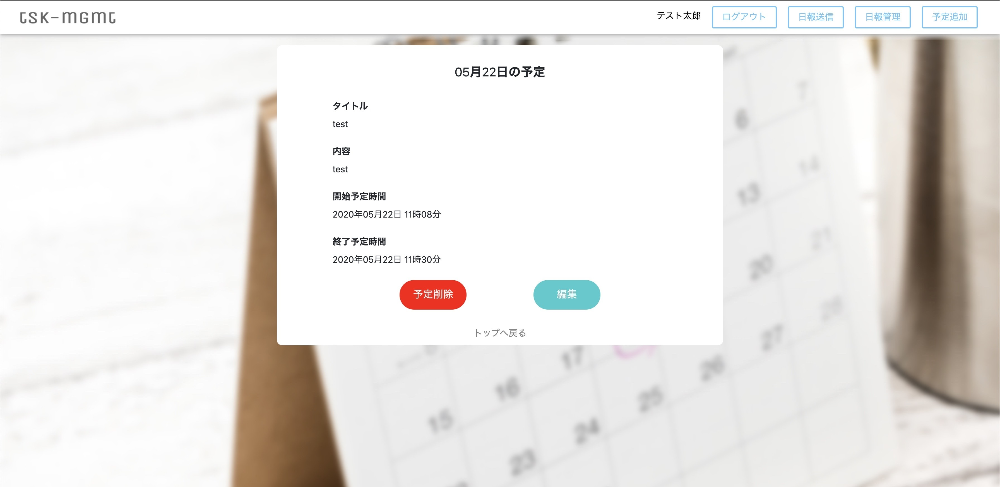
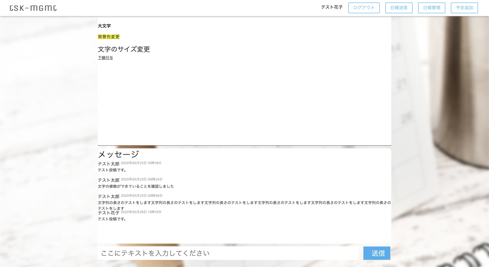

# サイト名
tsk-mgmt  

# URL
http://18.178.191.12/  

# 作成経緯
日報を確認してもらえないことがあり、情報伝達がうまくできなかった経験がありました。  
このミスを無くすために、日頃から確認する、予定表と日報の機能を組み合わせることで解決できると思い、
このサイトを作成いたしました。

# このサイトで可能なこと
・日々の予定の管理  
・日報の送信及び、日報に対するメッセージのやり取り  

# フレームワーク及び、使用言語
フレームワーク  
Ruby on Rails(Ver5.2.4.1)  
  
使用言語  
HAML(ver5.1.2)  
SCSS(ver3.7.4)  
jquery(ver1.12.4)  
Ruby(ver2.5.1)  

# 使用方法
**ログインページ**  
URL先を開くとログインページが表示されます。  
機能の参照だけ行いたい方はテストアカウントを用意しておりますので、以下情報でログインをお願いいたします。  
  
テストアカウント①(ユーザー名:テスト太郎)  
メールアドレス：test@gmail.com  
パスワード：aaaaaaaa  
  
テストアカウント②(ユーザー名:テスト花子)  
メールアドレス：test@yahoo.co.jp  
パスワード：aaaaaaaa  
  
  
**新規登録ページ**  
新規登録ボタンを押されますと、以下ページが表示されますので、入力をお願い致します。  
既に登録されているユーザー名を入力された場合、登録が不可能ですので、ご注意ください。  
  
  
**メインページ**  
ログインもしくは、新規登録が完了しますと、以下ページが表示されます。  
このページでは、カレンダーに予定追加を行ったものを、月、週、日、タスクリストごとに参照することができます。  
  
  
**予定詳細ページ**  
予定追加したものをクリックしていただくと以下のように詳細な情報を閲覧していただくことが可能です。  
ここでは、予定の変更、削除を行うことができます。  
  
  
**予定追加ページ**  
右上の予定追加ボタンをクリックしていただくと、カレンダーへ予定追加が行えます。
  
  
**日報送信ページ**  
右上の日報送信ボタンをクリックしていただくと、日報送信が行えます。  
宛先にはユーザー名を入力していただくことで検索が可能です。  
宛先を入れて日報を送りたい方は、「テスト太郎」もしくは「テスト花子」を入力していただくことで検索が可能でございます。  
また、宛先を入れずに自分自身のみに送ることも可能でございます。  
  
  
**日報管理ページ**  
右上の日報管理ボタンをクリックしていただくと、日報の管理画面が開きます。  
この画面では自分が送った日報(送信BOX)と、送られてきた日報(受信BOX)の確認ができます。  
  
詳細を確認したい日報をクリックしていただくと、その日報の詳細画面が開きます。  
その日報内で、送信者及び、受信者のメッセージのやり取りが可能でございます。  
  
  
# License
This software is released under the MIT License, see LICENSE.

# Authors
作者を明示する。特に、他者が作成したコードを利用する場合は、そのコードのライセンスに従った上で、リポジトリのそれぞれのコードのオリジナルの作者が誰か分かるように明示する（私はそれが良いと思い自主的にしています）。

# References
参考にした情報源（サイト・論文）などの情報、リンク
